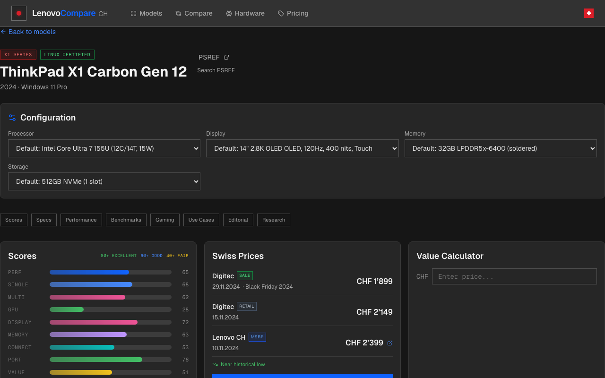
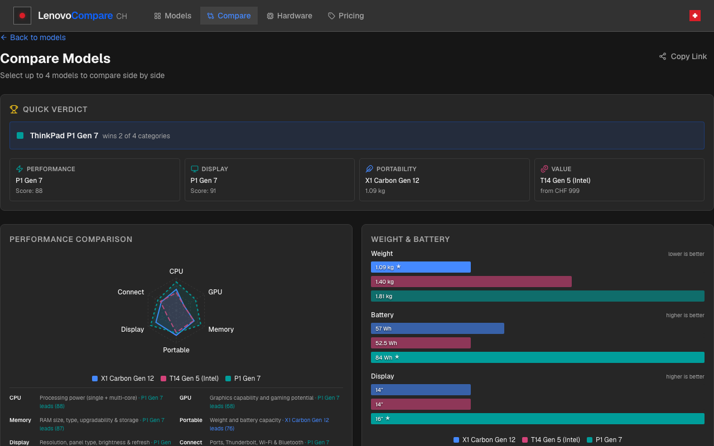

# LenovoCompare CH

A local-first Swiss-market Lenovo laptop comparison tool covering **98+ models** across three lineups: **ThinkPad**, **IdeaPad Pro**, and **Legion** (2018–2025).

Built with Next.js 14 and a dark IBM Carbon-inspired aesthetic. All specs are hardcoded from public [PSREF](https://psref.lenovo.com) data — no scraping, no external APIs, no tracking.

<!-- TODO: Add screenshots



-->

## Features

- **Browse & filter** — Grid of 98+ models filterable by lineup (ThinkPad / IdeaPad Pro / Legion), series, and sort order
- **Model detail pages** — Full specs, config selector, performance radar, benchmark charts, thermal/battery data, Linux compatibility, editorial analysis
- **Side-by-side compare** — Compare up to 4 models with CPU, GPU, portability, and performance radar charts
- **Swiss pricing** — User-contributed CHF prices stored in localStorage with import/export, seed prices for all models
- **Hardware guide** — Curated CPU and GPU analysis with strengths, weaknesses, thermal notes, and alternatives
- **Scoring system** — Absolute (cross-lineup) scoring across 6 dimensions: Performance, Display, Memory, Connectivity, Portability, Value
- **Upgrade simulator** — RAM/storage upgrade simulation with memory score comparison
- **Gaming analysis** — GPU benchmarks with FPS estimates and gaming tier classification
- **Linux compatibility** — Per-model certification status, supported distros, kernel and driver notes
- **Mobile-friendly** — Swipeable compare cards, responsive grid, touch-optimized filters

## Tech Stack

| Layer      | Technology                                                      |
| ---------- | --------------------------------------------------------------- |
| Framework  | Next.js 14 (App Router)                                         |
| Language   | TypeScript 5                                                    |
| Styling    | Tailwind CSS 3 + IBM Carbon dark theme                          |
| Charts     | recharts                                                        |
| Animations | framer-motion                                                   |
| Icons      | lucide-react                                                    |
| Testing    | Vitest                                                          |
| CI/CD      | GitHub Actions (lint, test, build, CodeQL, GitHub Pages deploy) |

## Getting Started

### Prerequisites

- Node.js 20+
- npm

### Install & Run

```bash
git clone https://github.com/flong/lenovocompare-ch.git
cd thinkcompare-ch
npm install
npm run dev
```

Open [http://localhost:3000](http://localhost:3000).

### Docker

```bash
docker compose up
```

Dev server runs on port 3000.

### Commands

```bash
npm run dev       # Development server
npm run build     # Production build (includes data validation)
npm run lint      # ESLint
npm test          # Vitest unit tests
```

## Project Structure

```
app/                    # Next.js App Router pages
  model/[id]/           #   Model detail page
  compare/              #   Side-by-side comparison
  pricing/              #   Price management
  hardware/             #   CPU/GPU hardware guide
components/
  charts/               # recharts: radar, bar, FPS, thermal, battery
  compare/              # Compare table, mobile cards
  filters/              # Lineup, series, sort filters
  pricing/              # Price input, import/export
  thinkpad/             # Model detail components
  ui/                   # Shared UI (ScoreBar, Toast, ErrorBoundary)
  layout/               # Header, Footer
data/
  laptops.ts            # 98+ models with full PSREF specs
  cpu-benchmarks.ts     # 80+ CPUs with single/multi/composite scores
  gpu-benchmarks.ts     # 28+ GPUs with gaming tiers and FPS estimates
  model-benchmarks.ts   # Per-model chassis benchmarks (thermals, battery, SSD)
  linux-compat.ts       # Per-model Linux compatibility
  model-editorial.ts    # Curated editorial for all models
  hardware-guide.ts     # CPU/GPU analysis and recommendations
  seed-prices.ts        # ~205 curated Swiss prices in CHF
  price-baselines.ts    # MSRP, retail, and historical price baselines
lib/
  types.ts              # Core interfaces (Laptop, Lineup, SwissPrice, etc.)
  scoring.ts            # Scoring engine (CPU, GPU, display, memory, etc.)
  analysis.ts           # Auto-generated pros/cons, use cases, verdicts
  constants.ts          # App constants, retailers, colors
  hooks/                # Custom React hooks
  retailers.ts          # Swiss retailer URL builders
  formatters.ts         # CHF, weight, date, storage formatters
  filters.ts            # Filter logic
tests/                  # Vitest unit tests
```

## Data Sources

All data comes from publicly available sources:

- **Specs**: [Lenovo PSREF](https://psref.lenovo.com) (public product reference)
- **CPU benchmarks**: Publicly available aggregate benchmark data
- **GPU benchmarks**: Publicly available aggregate benchmark data
- **Chassis benchmarks**: [NotebookCheck](https://www.notebookcheck.net) reviews (linked, not scraped)
- **Pricing**: User-contributed via the app's pricing interface

No retailer websites are scraped. Review links are outbound only.

## Contributing

See [CONTRIBUTING.md](CONTRIBUTING.md) for setup instructions, coding conventions, and data contribution guidelines.

The most impactful contributions are **data additions** — new laptop models, benchmark updates, Linux compatibility notes, and Swiss price data.

## License

MIT
